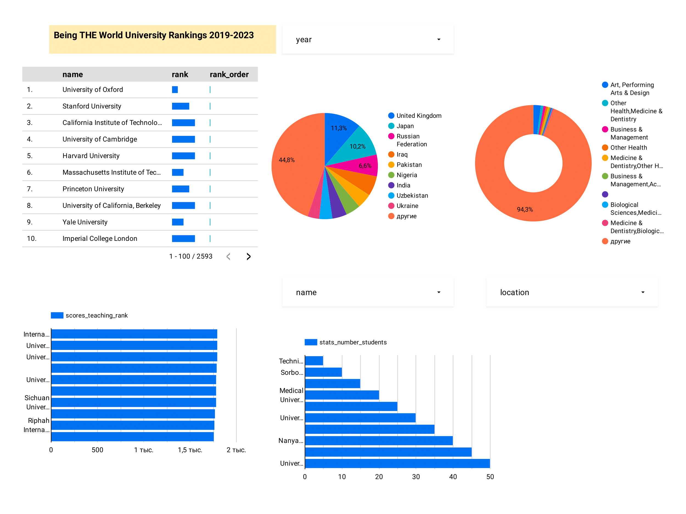

## THE World University Rankings 2011-2023 Project

I built a batch data pipeline that extracts, transforms and loads the [THE World University Rankings 2011-2023](https://www.kaggle.com/datasets/r1chardson/the-world-university-rankings-2011-2023) dataset into a Data Warehouse in the [Google Cloud Platform (GCP)](https://cloud.google.com/).

## Project description

This project has the goal of answering the following questions:

1. What is the Top university ranking over past 5 years?

2. Top university teaching and research scores over a past 5 years.

3. Segmentation of University ranking by location, scores teaching rank, number students.

### How the data pipeline works

* Prefect dataflows:

    1. [ETL Web to GCS](./workflows/web_to_gcs/etl_web_to_gcs.py): fetches data from the NYC Open Data API (Extract), converts the ZIP CODE column to int to avoid mixed type exceptions and creates the CRASH DATETIME column by merging the CRASH DATE and CRASH TIME columns (Transform), and loads the data into GCS (Load).

    2. [ETL GCS to BigQuery](./workflows/gcs_to_bq/etl_gcs_to_bq.py): fetches data from GCS (Extract), transforms string columns by stripping leading and trailing whitespaces, replacing multiple spaces with a single space and bringing all column names to lowercase (Transform), and loads the data into BigQuery (Load).

* Dbt models:

    1. [stg_crashes](./dbt_nyc_mvc/models/staging/stg_rank.sql): selects a subset of columns from the raw table that was loaded into BigQuery, sorted records by rank.

### Technologies

* [Pandas](https://pandas.pydata.org/) for fetching the dataset from the API endpoint.

* [Prefect](https://www.prefect.io/) and [Prefect Cloud](https://www.prefect.io/cloud/) for dataflow implementation and workflow orchestration.

* [Terraform](https://www.terraform.io/) for managing and provisioning infrastructure (GCS bucket, Data Warehouse and Virtual Machine) in GCP.

* [Docker](https://www.docker.com/) for encapsulating the dataflows and their dependencies into containers, making it easier to deploy them.

* [Data build tool (dbt)](https://www.getdbt.com/) for transforming, partitioning and clustering the dataset in the data warehouse.

* [Google Lookerstudio](https://lookerstudio.google.com/) for creating a dashboard to visualize the dataset.

* [Spark](https://spark.apache.org/) for large-scale data processing.

## Results

The dashboard is publicly available in this [link](https://lookerstudio.google.com/u/1/reporting/bf30356b-7e05-496b-a43c-dc74c96f0301).

